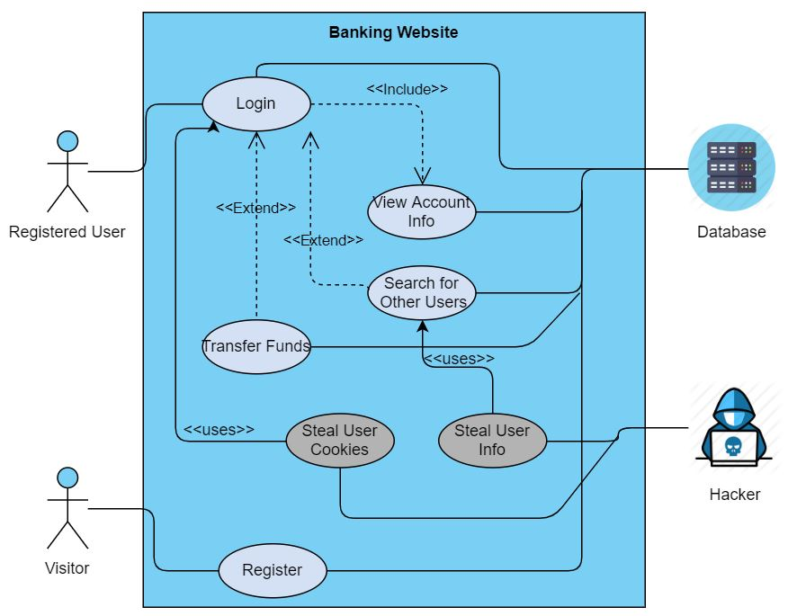

## Mini-Project 1 --- Salt/Pepper Hash and Web Exploit Prevention

Use/Abuse Case Diagram and Functionalities

**Use Cases:**
- A visitor can register an account on the website by inputting an email, username, password, and initial fund amount. This information is used to create a new entry in the database.
- A registered user (i.e. an existing bank customer) can log in to their account using their email and password. 
  
  Note: The password input is hashed with an algorithm, and the resulting value is compared to the database entry corresponding with that email. If it matches, the user is authenticated and logged in.
- A logged-in user can view their account information (i.e. username and available funds amount). This is automatically displayed once logged in.
- A logged-in user can search for existing users by inputting the other user's username into a search box.
- A logged-in user can transfer a certain amount of funds to another user by knowing the other user's email.

**Abuse Cases:**
- An attacker can steal other users' account information through the search box on the logged-in page and gain access to private data (e.g. all user emails, funds, etc). This presents an information leak security issue.
- An attacker can steal other users' cookies and perform session hijacking, which enables the attacker to spoof being another user and transfer funds.

**Links to screencasts:**

Login functionality: https://www.youtube.com/watch?v=dUIP_w_sq2Y

SQL injection: https://www.youtube.com/watch?v=pXFihys7pyI

IDOR: https://www.youtube.com/watch?v=TBdiKiMpdVo

CSRF: https://www.youtube.com/watch?v=aEC1HiTkOV0

XSS: https://www.youtube.com/watch?v=YOtaV5Kqe1k
